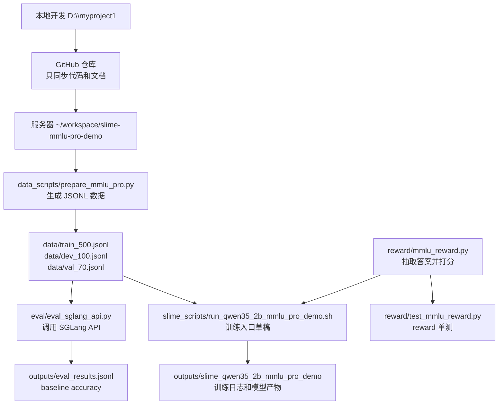

# 整体架构

这个 demo 的目标是：用 `TIGER-Lab/MMLU-Pro` 数据集、`Qwen/Qwen3.5-2B` 模型和 slime 训练框架，先搭一个小规模可验证链路。当前重点不是追求最终效果，而是把数据准备、reward（奖励函数）、SGLang eval（推理评估）和 slime 训练脚本入口串起来。

## 本地开发、GitHub、服务器之间的关系

- 本地开发目录：`D:\myproject1`
- demo 目录：`D:\myproject1\experiments\mmlu_pro_qwen35_2b_slime_demo`
- 服务器目标目录：`~/workspace/slime-mmlu-pro-demo`
- GitHub 用于同步代码和文档，不用于提交生成的数据、训练输出、虚拟环境。

推荐流程是：

1. 本地修改代码和文档。
2. 本地运行轻量测试，例如 reward 单测。
3. 提交并推送到 GitHub。
4. 服务器从 GitHub clone（克隆）或 pull（拉取）代码。
5. 服务器生成数据、准备模型、启动 SGLang 或 slime。
6. 服务器产生的 `data/`、`outputs/` 不提交到 Git。

## 数据准备流程

数据准备脚本是 `data_scripts/prepare_mmlu_pro.py`。

当前逻辑：

- 从 Hugging Face 数据集 `TIGER-Lab/MMLU-Pro` 加载数据。
- 用 `test` split（数据划分）生成 train 和 dev。
- 用 `validation` split 生成 val。
- 输出 JSONL 文件，每行包含 `prompt`、`label`、`metadata`。
- prompt 要求模型最后按 `Final answer: <A-J>` 输出。

默认输出：

- `data/train_500.jsonl`
- `data/dev_100.jsonl`
- `data/val_70.jsonl`

小规模调试时可以输出：

- `data/train_20.jsonl`
- `data/dev_10.jsonl`
- `data/val_70.jsonl`

## reward 评估流程

reward 文件是 `reward/mmlu_reward.py`。

它负责把模型输出转成分数：

- 从模型文本里抽取 A-J 选项。
- 支持 `Final answer: A`、`The answer is (B)`、`Answer: C`、尾部单独字母等格式。
- 抽取结果和 label 一致，返回 `1.0`。
- 错误、无答案、非法 label，返回 `0.0`。

单测文件是 `reward/test_mmlu_reward.py`。它用 unittest（Python 自带单元测试框架）验证答案抽取和打分逻辑。

## SGLang eval 流程

eval 脚本是 `eval/eval_sglang_api.py`。

它假设服务器上已经启动了本地 SGLang OpenAI-compatible API（兼容 OpenAI 格式的接口）：

```text
http://localhost:30000/v1/chat/completions
```

流程：

1. 读取 JSONL 数据。
2. 把每条 `prompt` 作为 user message（用户消息）发给 SGLang。
3. 从模型回复中抽取 A-J。
4. 和 `label` 对比。
5. 计算 accuracy（准确率）。
6. 每条结果写入 `outputs/eval_results.jsonl` 或命令行指定的输出文件。

## slime 训练脚本预期接入位置

训练脚本草稿是 `slime_scripts/run_qwen35_2b_mmlu_pro_demo.sh`。

它当前是服务器侧草稿，预期在服务器上接入：

- 模型路径：`MODEL_PATH`
- 数据路径：`TRAIN_DATA`、`DEV_DATA`
- reward 文件：`REWARD_FILE`
- 输出目录：`OUTPUT_DIR`
- 小规模 8 卡 3090 参数：`rollout_batch_size=2`、`n_samples_per_prompt=2`、`global_batch_size=4`、`num_steps_per_rollout=1`、`num_rollout=5`、`max_response_len=512`

这个脚本还需要在真实 slime 环境里验证 CLI 参数是否完全匹配。

## 文本架构图


